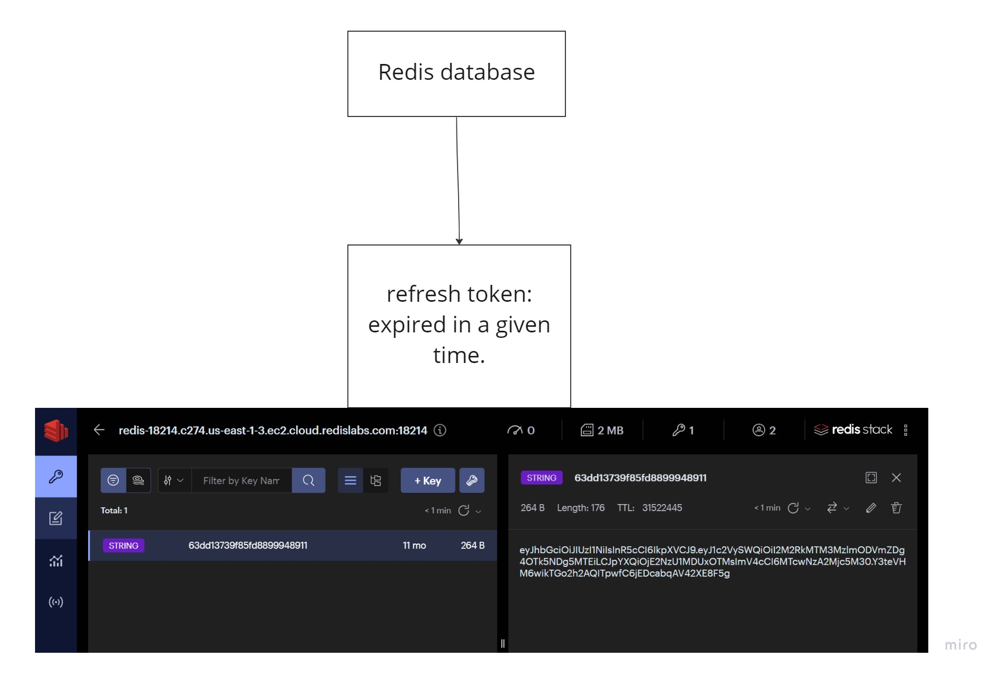

## BACKEND SIDE - SERVER

#### Prerequisites:
    If you would like to use test files, please install: "cross-env", "supertest" and "jest" libraries.
#### Configurations: 
    Contact me if you want to have look at .env file (can not add to Github).
#### How to run the project?
    In development mode: yarn dev
    In test mode: yarn test
#### Description: 
    
#### Technologies: 
    "express-generator": to generate an application and to get started with express
    "nodemon": automatically restarting the node application when file changes are detected.
    "mongoose": to work with MongoDB.
    "cors": to enable CORS with varios options.
    "dotenv": to load environment variables from a ".env" file into process.env.
    "helmet": to secure the app by setting several HTTP headers.
    "http-errors": to create HTTP errors for each request (if any).
    "date-fns": manipulating JS dates.
    "bcrypt": to hash passwords.
    "cross-env": to set environment variables.
    "googleapis": to use google api, set credentials by oAuth2
    "ioredis": to connect to redis in Nodejs
    "joi:: to validate information of user.
    "jsonwebtoken": to create access token and refresh token.
    "nodemailer: to send verify email to user.

    *********************** Dev Dependencies ************************************************
    "jest": to test the app.
    "supertest": for testing HTTP.
    "eslint": avoid syntax error and unused code. 

Overall

Folder structure workflow

1. Folder explanation:

- bin: where we create server and listen to a port.

- src/api/v1 (v1 means version 1):
    + controllers: receive requests from app, handle requests and response back.
    + databases: initialize databases, such as mongoDB and redis.
    + helpers: small functions - used to handle a couple of small tasks like: validation, error handler...
    + html: contains html file (nodemailer used to send to client.)
    + logs: contain event logs
    + middlewares: in this project, it will verify access/refresh token (not truly needed now)
    + models: define schema and generate form of data in mongodb
    + routes: define routes of a whole app
    + services: is called by controllers to find out data from databases.

- tests: test controllers and services.

2. Databases:

- MongoDB: 

- Redis: 

