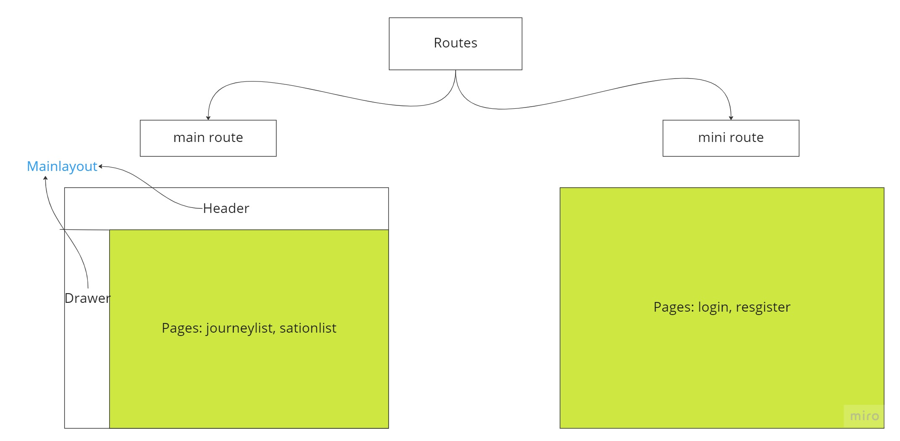
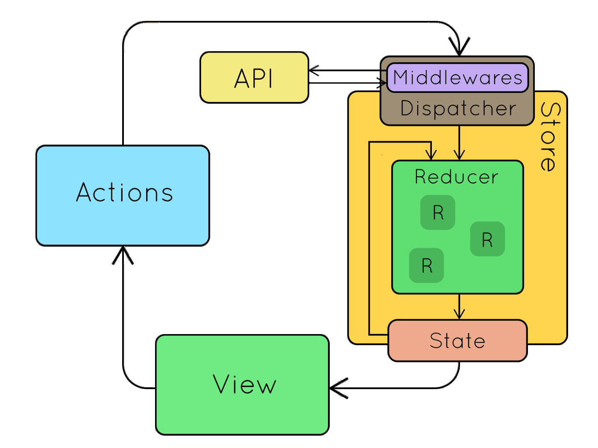

## FRONTEND SIDE - WEBAPP

#### Prerequisites:
    If you would like to use test files, please install: "jest" libraries.
#### Configurations: 
    Contact me if you want to have look at .env file (can not add to Github).
#### How to run the project?
    In development mode: yarn dev
#### Description: 
    This part is mainly for visualizing data from server.
#### Technologies: 
    "react": is a JavaScript library for creating user interfaces.
    "@mui": Using several libraries from Material UI: mui-lab, mui-datagrid, SVG icons... to build the style of webapp
    "axios": is a promise-based HTTP Client for node.js and the browser which used to request data from server.
    "moment": a JavaScript date library for parsing, validating, manipulating, and formatting dates.
    "redux libraries": react-redux, redux-saga, @reduxjs/toolkit to manage state in our webapp.
    "simplebar": to keep the native overflow: auto scroll and only replace the scrollbar visual appearance.
    "@ant-design": to use colors and icons.
    "apexcharts": to build several charts in dashboard such as: area chart, bar chart...
    "formik": to create forms and manage data from input fields.
    "framer-motion": to create animation for buttons.
    "leaflet": to create map for each station.
    "prop-types": type checking for React props.
    "react-router-dom": to manage router in a whole of app.
    "yup": to validate forms.
    "react-redux": to manage state in a whole of app.
    "redux-saga": is a middleware to call API, set global state...

Overall

1. Folder Structure:

- api: where we create axios client and apis.
- assets: contains logo and background pictures.
- components: contains several components.
- config: saves common setting of this webapp and menu-items of navigation in drawer.
- layout: defines main/mini layout of this application
- models: defines type of data.
- pages: contains pages of this webapp, slices/reducers and saga for each page.
- routes: seperate main/mini route.
- store: where we initialize reducer store and root saga, and create hooks: useAppDispatch && useAppSelector.
- theme: provides theme, color for a whole of app.
- utils: store a couple of small functions like: convertTime, passwordStrength...

2. Concepts of this webapp:

source: medium

- A page in src/pages: dispatch a action by useAppSelector (e.g: getStationList) 

- Store (src/pages: something.slice.ts): is dispatched

- Middlewares: redux-saga (src/pages/ something.saga.ts)
    + a saga calls api from src/api folder
    + changes state in the store

- View (src/pages Something.tsx): receives "state" by using useAppSelector

    

